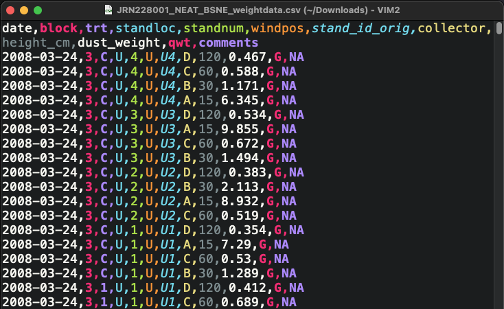

## Overview

:construction: **Most of this chapter is under construction.**

In this chapter we present some best practices to help you collect quality Jornada data that can be used in the future. The advice here varies depending on the type of data being collected --- there are many kinds of research data --- but some common themes apply. You should use consistent standards to collect, format, and apply quality assurance and control operations (QA/QC) to your data, all while describing the process and data products with rich metadata. These steps are the first building blocks of your research data workflow.

{width=325px fig-alt="A sequence of images arranged in a line showing the data collection process from field notebook to analysis results."}

## Collecting useful data

Research data are very diverse, but there are some common techniques to manage new data and make them useful. Below we discuss data management best practices organized around several of the data attributes of data you'll deal with in the real world.

* **Content and source**: What the data are about and where they came from
* **Data format**: How data are represented in terms of structure, organization, and relationships
* **File format**: The physical format the data are stored in, such as a text file or JPEG image
* **Intended use**: How the data will be used

We are using **tabular data**, such as spreadsheets, comma-separated value (CSV) files, and similar tables, as the primary example here because they are the most common and recognizeable kind of data the environmental sciences. In fact, lots of data we don't think of as tabular can still be represented in a table. A "Special cases" section below gives examples for other data types.

### Content and source

Many variables, about any number of phenomena, can be measured or observed. The **content** of the data refers to what the data you collect are about. So, what variables did you collect, and what real-world place, organism, thing, or process did you observe or measure them from? For our purposes at the Jornada we are usually studying biotic or abiotic phenomena in our slice of the Chihuahuan Desert. Make sure to create some good metadata about the content of your data that can be used as context in a published dataset.

The **source** of the data refers to where the data came from and how they were acquired. So, were the data collected in the field by a primary observer? By an autonomous sensor system? Or did the come from another researcher? In modern research it is common to integrate data from multiple sources, and it pays to document those sources well. If you collect the data yourself you have the opportunity to describe how you did so with rich metadata, which will make your data useful for the long term. If you use a previously-collected dataset, you'll need to interpret and then cite it, and you'll have an easier time if the creator was diligent about their metadata.

::: {.callout-tip}
## Best practices

**For data content:**

1. Know what your data are about, including the system being studied, and the variables observed or measured.
2. Be prepared to describe what the data are about in your metadata.
3. Be aware of any requirements and limitations for the data you collect (e.g. human subject or endangered species data).

**For data source:**

1. Keep a detailed field or laboratory notebook to document your data collection activities.
2. For autonomous data-collection systems (dataloggers, sensors, etc) keep extensive documentation, installation photos, and a log of changes and known issues.
3. If you synthesize data from external sources or published studies, document the origin of all data you use.

:::

### Data format

There are at least two meanings wrapped up in the term "data format." First, a data format describes the way data are structured, organized, and related.[^1] For example, tabular data files contain rows and columns that represent the variables and observations of the data, and there can be more than one way to arrange those. The second meaning of "data format" refers to the fact that the data values for any variable can be represented in more than one way. An identical date, for example, can be formatted as the text string “July 2, 1974” or as “1974-07-02.”

For tabular data, structuring the data you collect into the simplest possible table format is the best policy. First think about what variables you collect. Some will be categorical (treatment, plot number) and some are continuous (measured biomass, temperature). Then consider what an observation is. *Is it a monthly measurement of a plant, or an hourly temperature value recorded by a sensor?* Then, organize these values logically into clearly labeled columns and rows so that the data are understandable. If you've heard of "Tidy data", this is a great mental model to use for organizing data in a table [@wickham_tidy_2014]. In tidy tables, the columns are always variables and the rows represent observations (more details below). When you format the actual data values within the table, use the most understandable and granular format you can. If you have a nested experimental design with blocks, plots, and individuals for example, separate the values for these variables into different columns. For date and time values, we recommend using the [ISO standard](https://en.wikipedia.org/wiki/ISO_8601) (YYYY-MM-DD) rather than the traditional month-day-year (mm/dd/yy) format. The tabs below have some examples.

[^1]: The concepts of data formats and data structuring can become fairly complicated and are related to the disciplines of [database design](https://en.wikipedia.org/wiki/Database_design) and [data modeling](https://en.wikipedia.org/wiki/Data_modeling). For example, when designing a database one must decide what the entities (tables), attributes (columns), and relationships (links between tables/columns) are. We won't go into this much depth here, but it can sometimes be useful to have a detailed conceptual picture of how your research data fit together.

::: {.panel-tabset}

## A not-great table

In this example table you can see several data no-no's.

{.lightbox width=40%}

* Several categorical variables have been joined into one in the "LOC" column.
* The variable names don't give you a hint of what they are.
* The "DATE" column would be easy to misinterpret.
* There is no missing value indicator. For blank observations, was the individual missing or did the observer make a mistake?

## A better table

In this example most of those issues have been corrected.

{.lightbox width=70%}

* The variable columns are distinct and have granular values with clear column labeles.
* The date column follows the ISO standard (YYYY-MM-DD).
* "NA" values are used for missing data, and there is a comment column indicating what they mean.

:::

::: {.callout-caution collapse="true" icon="false"}
## More about Tidy data

In the *Tidy data* paper [@wickham_tidy_2014], the claim is that "80% of data analysis is spent on the process of cleaning and preparing the data." Adhering to a clear, easy-to-understand data format can help lower this burden and make data easier to clean, filter, and analyze. The tidy data model, or "long" format, aims to do this by following three rules:

* Each column holds one variable.
* Each row represents observation.
* Each cell holds a single value.

The resulting tables look like so:

This is in contrast to "wide," or "untidy," format, in which variables and observations may be organized in either rows or columns. The same data in wide format could look like either of these tables:

Keep in mind that wide/untidy format isn't always bad. Wide tables tend to take up less space on disk, and in addition, they can be called for in many standard statistical analyses.

**Bottom line**: Tidy data is a great default format with several advantages, but be ready to use wide/untidy formats when necessary too.
:::

::: {.callout-tip}
## Best practices

1. Use the simplest possible data structure.
2. Organize data by observational unit during collection.
3. Maximize the information for each observation.
:::

### File formats

* Some are specific to data type.
* Some are more accessible and versatile than others.
* When in doubt use a text file, like a comma separated value (CSV).

::: {.panel-tabset}

## Delimited text (CSV)

Delimited text files are a great format for using, archiving, and sharing your data. Rows of data values are stored as lines in a text files with a designated character serving as the delimiter between columns of data. They are simple to understand, fairly space-efficient, and easy to use with almost any tool in your data workflow (R, Python, Excel, GIS software, etc.). They may have a `.txt`, `.csv`, `.tsv`, or other file extension depending on the delimiter and convention.

{.lightbox width=80%}

## Excel spreadsheet

Microsoft Excel is a powerful spreadsheet program with a long history of use in research. Excel spreadsheets live in the `.xlsx` file format, though there are many other non-Microsoft formats Excel can read and write, including delimited text and `.csv` files. Also note that Microsoft Excel is not the only spreadsheet game in town. Google Sheets and LibreOffice Calc are both full-featured and can interoperate with Excel file formats very well.

{.lightbox width=90%}

Unfortunately, spreadsheets sometimes make the wrong assumption about the data you enter, and they are prone to being used in non-standard ways. That makes spreadsheet files a little less friendly as an archive and distribution format for research data. See the example below.

{.lightbox width=70%}

## Relational database

## Cloud-native

## Other

:::

::: {.callout-tip}
## Best practices

1. Use open, community standard file formats instead of proprietary ones whenever possible.
2. ...
:::

### Intended use

::: {.callout-tip}
## Best practices

1. ?
:::

### Special case data

Like people, many categories of data are special in their own way and don't fit into the traditional tabular mold. There is a detailed [Data Package Design for Special Cases](https://ediorg.github.io/data-package-best-practices/guide-special-cases/preface.html) guide from LTER Network IMs and EDI with more to say about these special cases [@gries_data_2021].

::: {.panel-tabset}

## Tabular

**Tabular data** is the default. Data values are arranged in columns and rows for variables and observations. 

## Images

Images captured from various sensors and platforms like cameras, UAVs, or remote sensing satellites.

* Content
* Source (or acquisition method)
* Data structure
* File format
* Intended use

## Sensor data

Data collected from sensors

* Content
* Source (or acquisition method)
* Data structure
* File format
* Intended use

## Geospatial

* Content
* Source (or acquisition method)
* Data structure
* File format
* Intended use

## Sequencing & 'omics' data

Sequencing and genomic data

* Content
* Source (or acquisition method)
* Data structure
* File format
* Intended use

:::

## Cleaning and QA/QC

The Jornada IM team has a significant amount of experience and a variety of tools to draw on for quality assurance and quality control (QA/QC) of long-term Jornada datasets. For data managed by individual researchers, the Jornada IM team leaves most data QA/QC up to the research group or individual, but we are happy to advise when asked. For a simple overview and some resources useful for QA/QC of tabular data, see [EDI's recommendations](https://edirepository.org/resources/cleaning-data-and-quality-control).

## Describing data as you collect it

![Example of the normal degradation in information content associated with data and metadata over time (“information entropy”). Accidents or changes in technology (dashed line) may eliminate access to remaining raw data and metadata at any time [from @michener_nongeospatial_1997]](img/michener97_information_loss.png){width=500px}

## Storage and backup

Store your data securely and have a reliable backup system for them.

