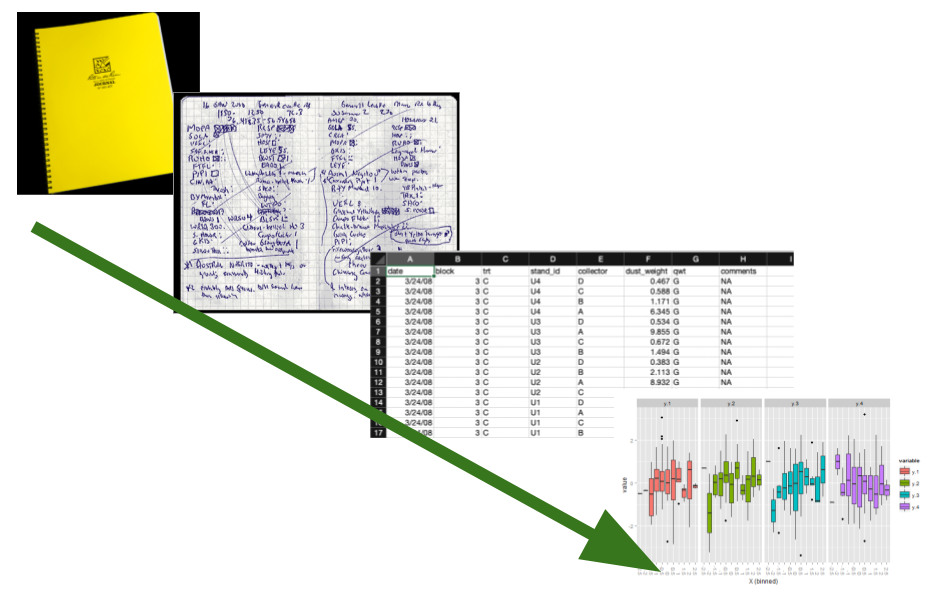
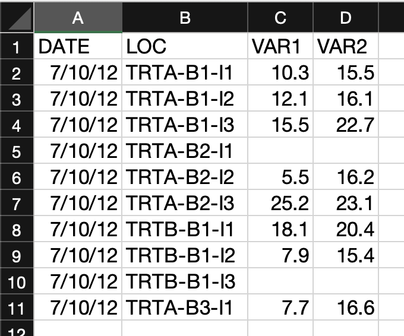
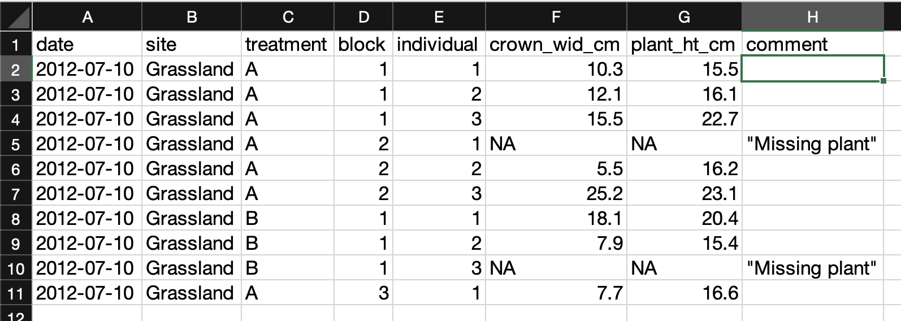
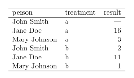
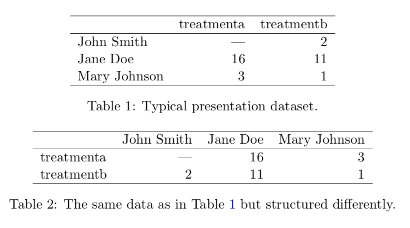
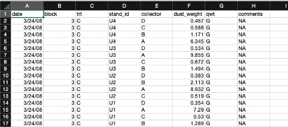

## Overview

:construction: **Most of this chapter is under construction.**

In this chapter we present important considerations and best practices for collecting quality Jornada data that can be used in the future. The guidance here varies depending on the data being collected --- there are many kinds of research data --- but some common themes apply. Try to use consistent, community-supported standards to collect, format, and clean your data, all while describing the process and data products with rich metadata. Following these recommendations will get your research data workflow off to a good start.

{width=325px fig-alt="A sequence of images arranged in a line showing the data collection process from field notebook to analysis results." #fig-dataworkflow}

## Collecting useful data

Research data are very diverse, but taking a thoughtful approach to collecting any data will make them more useful and easier to work with in the future. Below we consider several attributes of data you'll encounter and work with in the real world:

* **Intended use**: How the data will be used
* **Content and source**: What the data are about and where they came from
* **Data format**: How data are represented in terms of structure, organization, and relationships
* **File format**: The physical format the data are stored in, such as a text file or JPEG image

Below, we provide data management recommendations organized around these attributes, with **tabular data** as our default example. Tabular data values fit into grid- or table-like structures with rows and columns representing observations and variables. This type of data, which includes delimited text files (like comma-separated value files, or CSVs), spreadsheets and similar, are the most common and recognizeable data type in the environmental sciences. There are plenty of data that aren't exactly tabular, so the "Special cases" section is devoted to other types.

### Intended use

The **intended use**, or how your data will be used, is something you should start envisioning early in the research process, probably around the same time you are considering hypotheses, experimental design, and analysis plans. Intended use of the data influences many of the decisions you'll make during research, including data/metadata collection, formatting, quality assurance/control (QA/QC), and more. Its tough to give concrete advice here since there are many uses for any data, but here are a few questions you should ask:

* What is the research purpose of the data?
* What statistical analyses will you perform?
* Who will use the data, and will they be used for more than research?
* Will you publish the data? Where and when?

Keep in mind that new uses for data frequently arise during research, so you will probably end up revisiting these questions.

::: {.callout-tip}
## Recommendations

1. Think about intended uses for the data early - ideally before you collect it.
2. Consider how the data will be used beyond your research project.
:::


### Content and source

Many variables, about any number of phenomena, can be measured or observed. The **content** of the data refers to what the data you collect are about. So, what variables did you collect, and what real-world place, organism, thing, or process did you observe or measure them from? At the Jornada we are usually studying biotic or abiotic phenomena in our slice of the Chihuahuan Desert. Also pay attention to what is *not* in your data, e.g. what is excluded or missing, and any sources of bias. Remember that information about the content and limitations of your data will need to be in your metadata so it can provide context for a published dataset.

The **source** of the data refers to where the data came from and how they were acquired. So, were the data collected in the field by a primary observer? By an autonomous sensor system? Or did they come from another researcher? In modern research it is common to integrate data from multiple sources, and it pays to document those sources well. If you collect the data yourself you should describe how you did so with rich metadata, which will make your data useful for the long term. If you use previously-collected datasets, you'll need to find, acquire, analyze, and interpret the data and ***then cite them***. You'll have an easier time with that if the dataset creators were diligent about their metadata.

::: {.callout-tip}
## Recommendations

**For data content:**

1. Know what your data are about, including the system being studied, and the variables observed or measured.
2. Be prepared to describe what the data are about in your metadata.
3. Be aware of any requirements for, and limitations of, the data you collect (e.g. human subjects, endangered species, sampling bias).

**For data source:**

1. Keep a detailed field or laboratory notebook to document your data collection activities.
2. For autonomous data-collection systems (dataloggers, sensors, etc) keep extensive documentation, installation photos, and a log of changes and known issues.
3. If you synthesize data from external sources or published studies, document the origin of all data you use.

:::


### Data format

There are at least two meanings wrapped up in the term **data format**. First, a data format describes the way data are structured, organized, and related.[^1] Tabular data formats, for example, resemble a grid where rows and columns represent the variables and observations of the data, and there can be more than one way to arrange those. The second meaning of data format refers to the fact that the data values for any variable can be represented in more than one way. An identical date, for example, can be formatted as the text string “July 2, 1974” or as “1974-07-02.”

For tabular data, structuring the data you collect into the simplest possible table format is the best policy. First think about what variables you collect. Some will be categorical (treatment, plot number) and some are continuous (measured biomass, temperature). Then consider what an observation is. *Is it a monthly measurement of a plant, or an hourly temperature value recorded by a sensor?* Then, organize these values logically into clearly labeled columns and rows so that the data are understandable. If you've heard of "Tidy data", this is a great mental model to use for organizing data in a table [@wickham_tidy_2014 --- more details below]. In tidy tables, the columns are always variables and the rows represent observations (more details below). If you want to make sure the tabular data you collect follow fairly strict rules, consider using a relational database. Databases are not as simple as text files, but they do offer significant advantages for consistency and integrity of data.

When you format the actual data values within the table, use the most understandable and granular format you can. For example, if you have a nested experimental design with blocks, plots and individuals, separate the values for these variables into different columns and make sure they are consistent. For date and time values, we recommend using the [ISO standard](https://en.wikipedia.org/wiki/ISO_8601) (YYYY-MM-DD) rather than the traditional month-day-year (mm/dd/yy) format. If you use a database, you can ensure standard formats are used by applying rules in the database (constraints). 


[^1]: The concepts of data formats and data structuring can become fairly complicated and are related to the disciplines of [database design](https://en.wikipedia.org/wiki/Database_design) and [data modeling](https://en.wikipedia.org/wiki/Data_modeling). For example, when designing a database one must decide what the entities (real-world concepts), tables (relations), attributes (columns), and foreign-key relationships (links between tables/columns) are. We won't go into this much depth here, but it can sometimes be useful to have a detailed conceptual picture of how your research data fit together.

::: {.panel-tabset}

## A not-great table

In this example table you can see several data no-no's.

{.lightbox width=40%}

* Several categorical variables have been joined into one in the "LOC" column.
* The variable names don't give you a hint of what they are.
* The "DATE" column would be easy to misinterpret.
* There is no missing value indicator. For blank observations, was the individual missing or did the observer make a mistake?

## A better table

In this example most of those issues have been corrected.

{.lightbox width=70%}

* The variable columns are distinct and have granular values with clear column labeles.
* The date column follows the ISO standard (YYYY-MM-DD).
* "NA" values are used for missing data, and there is a comment column indicating what they mean.


## A relational database

Relational databases are collections of data tables that follow specific rules and have relationships connecting them to each other. In each table, rows hold a specific kind of data record refering to entities like observations, study sites, or organisms, and columns hold the variables (or "attributes") for the records. Records in different tables are related to each other via values in shared columns ("foreign keys"). The tables, columns, and relationships are defined in a database **schema**. Databases are a consistent and space-efficient way to store multidimensional data. Here's a diagram of a relational database schema with three tables: 

(Note this only works in new versions of Mermaid - Quarto is a little behind and will be up to date in 1.9. Preview [here](https://mermaid.live/edit#pako:eNqFUk1rwzAM_StG57Skado4ua4MRncoY6cRCG6tpmaxHWynbEvz35ePZrTZYL4Y6UnvPVmu4aA5QgJoNoLlhkmSKtIeLgwenNCKPL8Mmb3QkllLGj2bXS7EMlkWQuUZnlE5SxKSQsmMI_qYwn1HPYSECOUmfZng5HE74taZFmnLuDgLXrEiU5WcgLbEg0A7Zo-FZm5UyvIh3QzX1GJzaZ3XpCx077eHR6Zp7T-ed9tbvGN8uh2EM4evQuJVY9OGkzH03qI5o7kzPDir_6DeTd_Iil-UziBzsjV45QQPciM4JM5U6IFEI1kXQi-QgjuhxBS6xXFm3rutdT0lU29ay7HN6Co_QXJkhW2jquxGu36Vn6xBxdE86Eo5SCLac0BSwwckQbier4LYj-lq4UdhEHjwCUlM53QVhP4iWi6XMQ3DxoOvXtSfRwsaRHQdUxpHlC6C5ht4rtd_))

```{mermaid}
erDiagram 
    direction LR
    plants }o--|| sampling_events : "sampled in"
    plants {
      int sampling_event_id FK
      string site_name
      int plot_num
      int individual_num
      float crown_wid_cm
      float plant_ht_cm
    }
    sampling_events }|--|{ plots : samples
    sampling_events {
      int sampling_event_id PK
      int site_id FK
      dateTime sample_date
      string observer
    }
    plots {
      int plot_id PK
      string site_name
      int plot_num
      float centroid_lat
      float centroid_long
      string treatment
    }
```

The `plants` table holds records of measured plant dimensions and related variables, which are connected to a specific sampling event. The `sampling_event` table holds information about those events, including date, observer, and the plot sampled. The `plots` table is connected to `sampling_event` by the `plot_id` field and stores information about the name, location and treatment of the research plots. 

:::


::: {.callout-caution collapse="true" icon="false"}
## More about Tidy data

In the *Tidy data* paper [@wickham_tidy_2014], the claim is that "80% of data analysis is spent on the process of cleaning and preparing the data." Adhering to a clear, easy-to-understand data format can help lower this burden and make data easier to clean, filter, and analyze. The tidy data model, or "long" format, aims to do this by following three rules:

* Each column holds one variable.
* Each row represents observation.
* Each cell holds a single value.

The resulting tables look like so:



This is in contrast to "wide," or "untidy," format, in which variables and observations may be organized in either rows or columns. The same data in wide/untidy format could look like either of these tables:



Keep in mind that wide/untidy format isn't always bad. Wide tables tend to take up less space on disk, and in addition, they can be called for in many standard statistical analyses.

**Bottom line**: Tidy data is a great default format with several advantages, but be ready to use wide/untidy formats when necessary too.
:::


::: {.callout-tip}
## Recommendations

1. Use the simplest possible data structure.
2. Organize data by observational unit during collection.
3. Maximize the information for each observation.
:::

### File formats

The **file format** of your data refers to the physical file type that your data are stored in on a disk or other storage medium. File formats usually have a specification (or set or rules), a name, and a file extension. Some examples would be a delimited text file (file extension `.txt`, or others), a Microsoft Excel file (file extension `.xls` or `.xlsx`), or a JPEG image (file extension `.jpg` or `.jpeg`). File formats usually depend on the data content or source, and are sometimes specific to particular data uses or software programs. Whenever possible, try to choose file formats that are (a) simple to use and understand, and (b) accessible and familiar to your community or collaborators. For tabular data we usually recommend delimited text files, like the trusty **CSV**, whenever possible, but there are other choices to consider, and pros and cons for each, below. 

::: {.panel-tabset}

## Delimited text files

Delimited text files are a great format for using, archiving, and sharing your data. Rows of data values are stored as lines in a text files with a designated character serving as the delimiter between columns of data. They are human-readable, simple to understand, fairly space-efficient, and easy to use with almost any tool in your data workflow (R, Python, Excel, GIS software, etc.). They may have a `.txt`, `.csv`, `.tsv`, or other file extension depending on the delimiter and convention.

{.lightbox width=80%}


## Excel spreadsheet

Microsoft Excel is a powerful spreadsheet program with a long history of use in research. Excel spreadsheets live in the `.xlsx` file format, though there are many other non-Microsoft formats Excel can read and write, including CSV and ther delimited text files. Also note that Microsoft Excel is not the only spreadsheet game in town. Google Sheets and LibreOffice Calc are both full-featured and can interoperate with Excel file formats very well.

{.lightbox width=90%}

Unfortunately, spreadsheets sometimes make the wrong assumption about the data you enter, and they are prone to being used in non-standard ways. That makes spreadsheet files a little less friendly as an archive and distribution format for research data. See the example below.

{.lightbox width=70%}

## Databases

We discussed how relational databases structure data in the "Data format" section above. Databases are often used for very large data stores that are accessed by enterprise-level applications over a network, so they can be much more complicated than file-based data formats. But, there is a range to this complexity and there are some very friendly file-based databases that you can use easily on your local computer, share over email, or publish to a repository.

* SQLite is a single-file database. {width=150px}
* DuckDB is a single file columnar database optimized for big data analysis. {width=150px}

Keep in mind that you'll probably need to learn some new skills to use the data in a database, particularly if they are large or have a complex schema (many linked tables). The Structured Query Language, or SQL, is the standard programming language for working with data in databases. Basic SQL is not too hard to learn, and it is useful for more than just database queries because it has been integrated into many data science tools like the R "tidyverse", various Python libraries, and others.

### Tools and resources

* [DB Browser for SQLite](https://sqlitebrowser.org/) is a good, cross-platform database browser for SQLite databases that is easy to use.

## Cloud-native, columnar, and more

As we move towards creating and using high-volume research data, and employing cloud storage and computing services in research, there are some more advanced file formats to consider.

* Parquet files and other columnar formats
* Some databases


There are many other possible tabular data file formats. Some are good for quick, space-efficient storage, but not ideal for long-term preservation. Keep in mind that many of these formats are not easily human-readable without specialized sofware, so they may be difficult for novices to use. They may also be harder to describe with metadata, especially when publishing the daaset. Here are a few possible examples:

* R data binaries: R provides two file formats for storing data. RDS files (`.RDS`) store a single R object, and RData files (`.RData` or `.rda`) store multiple objects.
* Python data binaries: There are many, including Numpy single and multi-array archives (`.npy` and `.npz`), Pytables, pickle, and more
* NetCDF and HDF5
* JSON and XML
* Apache Feather

:::

::: {.callout-tip}
## Recommendations

1. Use open, community-standard file formats instead of proprietary ones whenever possible.
2. Try to use the simplest file format possible for your data.
3. For tabular data, the delimited text file, or CSV, is a sensible default.
:::


### Special case data

Above, we've used **tabular data** as the default example, but like people, all data are special in their own way and they don't always fit into a traditional tabular mold. Modern research datasets are becoming larger and more complex, multifaceted and distributed, meaning that we more often need to move beyond the simple data table paradigm. Examples include imagery, geospatial data, high-frequency sensor data, genomic data, models, and more. Some of these can still be represented in grid or table form, but because of high volume and complexity it helps to handle them differently. There is a detailed [Data Package Design for Special Cases](https://ediorg.github.io/data-package-best-practices/guide-special-cases/preface.html) guide from LTER Network IMs and EDI with excellent guidance for special cases like these [@gries_data_2021].

::: {.panel-tabset}

## Images

Images captured from cameras or similar imaging sensors. Individual images are usually represented as a rectangular grid of pixels with color, reflectance, or similar data values for each pixel, and there are often multiple bands (layers) in an image. Imagery data is very diverse and widely used in research.

+---------------+---------------------------------------------------------+
| Intended use  | - Monitoring change in ecosystems over time             |
|               | - Capturing occurrences or events                       |
|               | - Optical measurements over large spatial domains       |
+---------------+---------------------------------------------------------+
| Content       | - Repeat photographs of an ecosystem over time          |
|               | - Motion-detected images of animals                     |
|               | - Aerial or space-based RGB (red, green, blue),         |
|               |   multi/hyper-spectral, thermal, or other images        |
+---------------+---------------------------------------------------------+
| Source (or    | - Phenocams or repeat ground-based photos               |
| acquisition   | - Motion-activated camera (game cam)                    |
| method)       | - Unmanned aircraft system (UAS) with imaging sensor    |
|               |   payload, remote sensing aircraft or satellite         |
+---------------+---------------------------------------------------------+
| Data format   | - Single images can be represented as data grids with   |
|               |   Red/Green/Blue (or other) bands. Compression          |
|               |   algorithms are often applied.                         |
|               | - Repeat measurements may be collections or archives of |
|               |   many date-stamped images.                             |
|               | - Aerial or space-based images often have embedded      |
|               |   georeferencing information (making them geospatial).  |
+---------------+---------------------------------------------------------+
| File format   | - JPEG (`.jpeg` or `.jpg`)                              |
|               | - Zip archive (`.zip`) - for multi-image archives       |
|               | - GeoTIFF (`.tiff`) - for georeferenced images          |
|               | - NetCDF, HDF5, BIL (`.nc`, `.hdf`, `.bil`) -           |
|               |   for multiband & multidimensional imagery              |
+---------------+---------------------------------------------------------+

: Some examples of image data and their attributes. This is not an exhaustive list.


## Sensor data

Data collected from sensors

+---------------+---------------------------------------------------------+
| Intended use  | - Monitoring change in ecosystems over time             |
|               | - Capturing occurrences or events                       |
|               | - Optical measurements over large spatial domains       |
+---------------+---------------------------------------------------------+
| Content       | - Repeat photographs of an ecosystem over time          |
|               | - Motion-detected images of animals                     |
|               | - Aerial or space-based RGB (red, green, blue),         |
|               |   multi/hyper-spectral, thermal, or other images        |
+---------------+---------------------------------------------------------+
| Source (or    | - Phenocams or repeat ground-based photos               |
| acquisition   | - Motion-activated camera (game cam)                    |
| method)       | - Unmanned aircraft system (UAS) with imaging sensor    |
|               |   payload, remote sensing aircraft or satellite         |
+---------------+---------------------------------------------------------+
| Data format   | - Single images can be represented as data grids with   |
|               |   Red/Green/Blue (or other) bands. Compression          |
|               |   algorithms are often applied.                         |
|               | - Repeat measurements may be collections or archives of |
|               |   many date-stamped images.                             |
|               | - Aerial or space-based images often have embedded      |
|               |   georeferencing information (making them geospatial).  |
+---------------+---------------------------------------------------------+
| File format   | - JPEG (`.jpeg` or `.jpg`)                              |
|               | - Zip archive (`.zip`) - for multi-image archives       |
|               | - GeoTIFF (`.tiff`) - for georeferenced images          |
|               | - NetCDF, HDF5, BIL (`.nc`, `.hdf`, `.bil`) -           |
|               |   for multiband & multidimensional imagery              |
+---------------+---------------------------------------------------------+

: Some examples of sensor data and their attributes. Again, this is not an exhaustive.

## Geospatial

Geospatial data types are "georeferenced," meaning some kind of location information is included with each observation.

+---------------+---------------------------------------------------------+
| Intended use  | - Monitoring change in ecosystems over time             |
|               | - Capturing occurrences or events                       |
|               | - Optical measurements over large spatial domains       |
+---------------+---------------------------------------------------------+
| Content       | - Repeat photographs of an ecosystem over time          |
|               | - Motion-detected images of animals                     |
|               | - Aerial or space-based RGB (red, green, blue),         |
|               |   multi/hyper-spectral, thermal, or other images        |
+---------------+---------------------------------------------------------+
| Source (or    | - Phenocams or repeat ground-based photos               |
| acquisition   | - Motion-activated camera (game cam)                    |
| method)       | - Unmanned aircraft system (UAS) with imaging sensor    |
|               |   payload, remote sensing aircraft or satellite         |
+---------------+---------------------------------------------------------+
| Data format   | - Single images can be represented as data grids with   |
|               |   Red/Green/Blue (or other) bands. Compression          |
|               |   algorithms are often applied.                         |
|               | - Repeat measurements may be collections or archives of |
|               |   many date-stamped images.                             |
|               | - Aerial or space-based images often have embedded      |
|               |   georeferencing information (making them geospatial).  |
+---------------+---------------------------------------------------------+
| File format   | - JPEG (`.jpeg` or `.jpg`)                              |
|               | - Zip archive (`.zip`) - for multi-image archives       |
|               | - GeoTIFF (`.tiff`) - for georeferenced images          |
|               | - NetCDF, HDF5, BIL (`.nc`, `.hdf`, `.bil`) -           |
|               |   for multiband & multidimensional imagery              |
+---------------+---------------------------------------------------------+

: Some examples of geospatial data and their attributes. Again, this is not an exhaustive.

## Molecular

Molecular data types contain information about DNA, RNA, proteins, or other biological polymers in organisms or the environment. They can contain, for example, the sequence of nucleotides in DNA extracted from organisms or environmental materials like soils. These data may be complete genomes or other "omes" (transcriptome, metabolome, etc.), meaning the full sequence of a particular molecule, gene, or organism, and sometimes only specific markers within longer sequences are identified and included in the data (genotyping or barcoding approaches). In most cases, extensive metadata annotations and information about field/laboratory procedures and bioinformatics pipelines are needed to make these data interpretable.

+---------------+---------------------------------------------------------+
| Intended use  | - Monitoring change in ecosystems over time             |
|               | - Capturing occurrences or events                       |
|               | - Optical measurements over large spatial domains       |
+---------------+---------------------------------------------------------+
| Content       | - Repeat photographs of an ecosystem over time          |
|               | - Motion-detected images of animals                     |
|               | - Aerial or space-based RGB (red, green, blue),         |
|               |   multi/hyper-spectral, thermal, or other images        |
+---------------+---------------------------------------------------------+
| Source (or    | - Phenocams or repeat ground-based photos               |
| acquisition   | - Motion-activated camera (game cam)                    |
| method)       | - Unmanned aircraft system (UAS) with imaging sensor    |
|               |   payload, remote sensing aircraft or satellite         |
+---------------+---------------------------------------------------------+
| Data format   | - Single images can be represented as data grids with   |
|               |   Red/Green/Blue (or other) bands. Compression          |
|               |   algorithms are often applied.                         |
|               | - Repeat measurements may be collections or archives of |
|               |   many date-stamped images.                             |
|               | - Aerial or space-based images often have embedded      |
|               |   georeferencing information (making them geospatial).  |
+---------------+---------------------------------------------------------+
| File format   | - JPEG (`.jpeg` or `.jpg`)                              |
|               | - Zip archive (`.zip`) - for multi-image archives       |
|               | - GeoTIFF (`.tiff`) - for georeferenced images          |
|               | - NetCDF, HDF5, BIL (`.nc`, `.hdf`, `.bil`) -           |
|               |   for multiband & multidimensional imagery              |
+---------------+---------------------------------------------------------+

: Some examples of molecular sequencing/omics data and their attributes. Again, this is not an exhaustive. 

:::


## Cleaning and QA/QC

The Jornada IM team has a significant amount of experience and a variety of tools to draw on for quality assurance and quality control (QA/QC) of long-term Jornada datasets. For data managed by individual researchers, the Jornada IM team leaves most data QA/QC up to the research group or individual, but we are happy to advise when asked. For a simple overview and some resources useful for QA/QC of tabular data, see [EDI's recommendations](https://edirepository.org/resources/cleaning-data-and-quality-control).


## Describing your data (Metadata!)

As you collect and work with your data, there is a large amount of contextual information about the data that is accumulating. This contextual information is called **metadata**, and you don't want to lose track of it because it can be critically important for understanding and using the data later. Metadata are data about the data, and as a general rule, they should describe

  * **Who** collected the data
  * **What** was observed or measured
  * **When** the data were collected
  * **Where** the data were collected
  * **How** the data were collected (methods, instruments, etc.)
  * Sometimes, stating **why** the data were collected can help future users understand data context and evaluate fitness for use. 
  
Preserving these metadata along with your actual data (measurements, observations, etc.) makes them more usable, and helps prevent the loss of information about data over time, as illustrated in @fig-infodecay. When it comes time to publish the data, you'll want to include metadata files with the data. The term we use for this is **dataset**, which means a package of data and the metadata that describes it.

![Example of the normal deterioration in information content associated with data and metadata over time (“information entropy”). Accidents or changes in technology (dashed line) may eliminate access to remaining raw data and metadata at any time [from @michener_nongeospatial_1997]](img/michener97_information_loss.png){width=500px, #fig-infodecay}

### Creating and managing metadata

Assembling and preserving metadata is important and should become an integral part of any reproducible research and data work. **Make sure to plan for and start creating metadata early in your project**, and building metadata into daily workflows and project management practices is helpful.  Below are a few suggestions on how to start.

1. **Keep a detailed project log and populate it with useful metadata, such as:**
    a. how new data are collected,
    b. for ancillary data (not directly collected by you), document the original source of the data,
    c. how the data are cleaned, quality assured, and prepared for analysis,
    d. data analysis steps and methods used to create figures, statistics, and derived data products,
    e. who is doing what.
2. **Think about distinct publishable datasets and create structured metadata files for them.** You and your team should decide what the useful public data products will be, and then start gathering the appropriate metadata to accompany them to publication. You can do this
    a. locally, such as within a labeled directory containing your data (raw and cleaned/quality-assured) and metadata files. Metadata files may be plain text, or use [a metadata template](https://github.com/jornada-im/documentation/raw/main/templates/Jornada_metadata_template.docx).
    b. with a repository-based metadata editor, such as [ezEML](https://ezeml.edirepository.org) from the Environmental Data Initiative (EDI) repository, which will store data files and all essential metadata together.
3. **Ask a data manager or data curator to help or get involved in your project**. At the Jornada, the Information Management team is happy to help, or you can reach out to curators at our partner repository [Environmental Data Initiative](https://edirepository.org).[^1]. Other repositories and academic libraries often have professional data curators on staff who are well-trained and can advise researchers on community metadata standards and best practices for data publishing.[^2]

[^1]: Reach out to the Jornada IM team at <mailto:jornada.data@nmsu.edu>, or to the EDI support channel at <mailto:support@edirepository.org>. Here is a [list of Information Managers](https://lternet.edu/using-lter-dat/#im) at all LTER sites.
[^2]: The [Data Curation Network](https://datacurationnetwork.org/) is a professional membership organization for data curators.


## Storage and backup

Store your data securely and have a reliable backup system for them.

