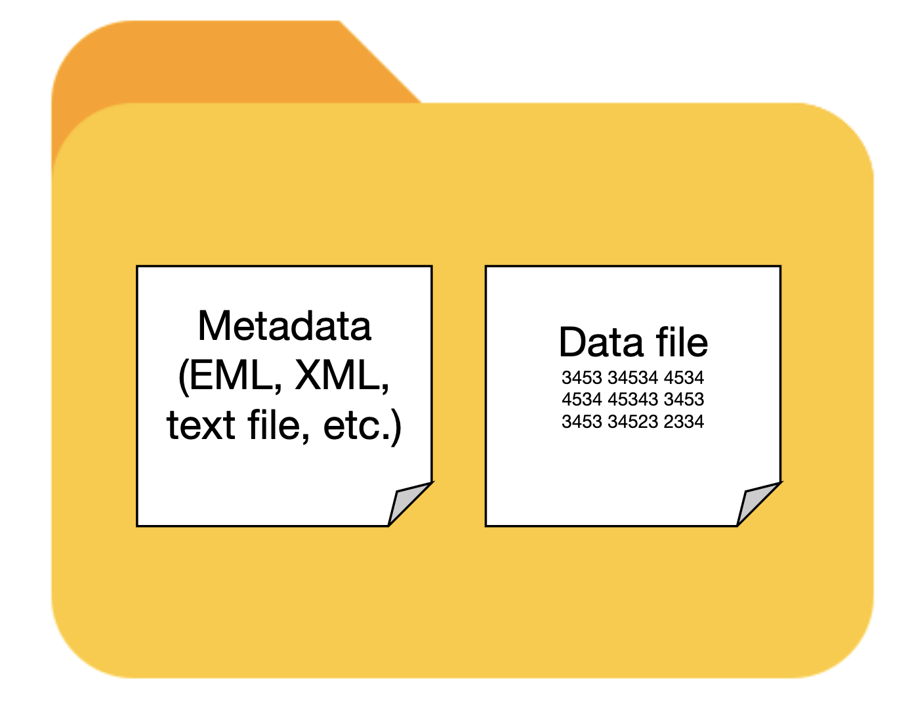

## Overview

In this chapter we present important considerations and best practices for collecting quality Jornada data that can be used in the future. The guidance here varies depending on the data being collected --- there are many kinds of research data --- but some common themes apply. Try to use consistent, community-supported standards to collect, format, and clean your data, all while describing the process and data products with rich metadata. Following these recommendations will get your research data workflow off to a good start.

{width=325px fig-alt="A sequence of images arranged in a line showing the data collection process from field notebook to analysis results." #fig-dataworkflow}

## Collecting useful data

Research data are very diverse, but taking a thoughtful approach to collecting any data will make them more useful to you and others down the road. The data you collect and work with in the real world have several attributes to consider:

* **Intended use**: How the data will be used
* **Content** What the data are about, including the variables and observational units
* **Source**: Where the data come from and how they were acquired
* **Data format**: How data are represented in terms of structure, organization, and relationships
* **File format**: The physical format the data are stored in, such as a text file or JPEG image

Below, we provide data management recommendations organized around these attributes, with **tabular data** as our default example. Tabular data values fit into grid- or table-like structures with rows and columns representing observations and variables. This type of data, which includes delimited text files (like comma-separated value files, or CSVs), spreadsheets and similar, are the most common and recognizable data type in the environmental sciences. There are plenty of data that aren't exactly tabular, so we also have sections devoted to unstructured data and other special cases.

::: {.callout-note}
## Introducing metadata and datasets

The four attributes of data highlighted above are the beginning of **metadata**, or data that describe other data. Metadata provide important context about the data we work with and are essential for making that data understandable and usable (we'll devote more time to this in [the next chapter](metadata.qmd)). Therefore, data and metadata should always travel together, and we have a special term for this pairing: a **dataset**. Datasets are fundamental units of information used in research, and important products of research activities, so we will refer to them often.

{width="40%" fig-align="center"}
:::

### Intended use

The **intended use**, or how your data will be used, is something you should start envisioning early in the research process, probably around the same time you are considering hypotheses, experimental design, and analysis plans. Intended use of the data influences many of the decisions you'll make during research, including data/metadata collection, formatting, quality assurance/control (QA/QC), and more. Its tough to give concrete advice here since most data can have many uses, but here are a few questions you should ask:

* What is the research purpose of the data?
* What statistical analyses will you perform?
* Who will use the data, and will they be used for more than research?
* Will you publish the data? Where and when?

Keep in mind that new uses for data frequently arise during research, so you will probably end up revisiting these questions.

::: {.callout-tip}
## Recommendations

1. Think about intended uses for the data early - ideally before you collect it.
2. Consider how the data will be used beyond your research project.
:::


### Content

The **content** of research data refers to what the data being collected are about. If you are the one doing the measuring or observing, you can describe the content of your data by specifying what variables are being collected, and what observational units, such as study plots, organisms, quantities of matter, or events, you are collecting them from. Describing the content of data can be laborious, but scientific observations, even relatively large and complex ones like remote sensing images, generally consist of variables that can be classified into standard [scales of measurement](https://en.wikipedia.org/wiki/Level_of_measurement), such as the Stevens typology. It is becoming become much more common for scientists to use large, unstructured datasets, including text, imagery, audio, and more, and it can be harder to describe the content of these with a clean classification system. Below are some considerations for common data content types, including the most common **scales of measurement** for scientific data: 

::: {.panel-tabset}

## Numeric

Numeric variables, also called "quantitative" data, consist of number values organized into a measurement scale. The Stevens typology defines two types of numeric measurement scales: interval and ratio.

* Interval scale: numeric values with equal spacing and no meaningful zero point. _Examples: degrees Celsius, dates_
* Ratio scale: numeric values with equal spacing and a zero point. _Examples: mass, length, counts, Kelvin_

Additionally, numeric data can be discrete or continuous.

* Discrete data have values that are countable with whole numbers.
* Continuous data are best represented as real numbers, and are divisible into fractions or decimals.

**What to remember about these data** 

* Numeric variables (interval and ratio) almost always have units, or at least a defined scale, and you should know what is appropriate for the data. The measurement units of quantities like mass (kg), temperature (°C), and time (s) should be recorded as you collect data. Even dimensionless variables usually have pseudo-units, such as a ratio (C:N), pH, number (count), or percentage, that needs to be documented with the data. 
* Numeric data can be further described by the type, or number set, they are drawn from (integers, real, complex numbers), and by their precision (number of decimal places specified) and significant figures (the number of meaningful decimal places).

## Categorical

Categorical variables, sometimes called "qualitative" data, consist of values that have defined levels used to classify or rank things. The Stevens typology defines two categorical scales of measurement: nominal and ordinal,

* Nominal scale: categorical values with levels that have no ordering, and are therefore equivalent to classifying things. _Examples: species, treatments, sex_
* Ordinal scale: categorical values with levels that rank or order things, but not necessarily with equal spacing between the levels. _Examples: Likert scale (strongly agree, somewhat agree...), fire severity_

Note that ordinal values have a numerical element to them (order or rank), so they don't fit cleanly as qualitative data.

**What to remember about these data**

* In categorical variables, each level (corresponding to a group in the data) must have one unique value. For example, in a column denoting the sex of captured rodents, you wouldn't assign some male individuals an "M" and some "male".
* The levels defined by categorical variables are arbitrary (nominal) or semi-arbitrary (ordinal) until a meaning is assigned. Assigning standardized values that can be understood by your community (authoritative species codes, the Likert scale) makes data much more broadly useful and interpretable.


## Boolean (binary) data

Boolean variables, or binary variables, are a subtype of nominal categorical data with only two levels. These levels can be represented as "yes or no", "True or False", 0 or 1, or other binary schemes.

**What to remember about these data**

* It seems simple, but it's not. Make sure you and others clearly understand what the _True/yes/1_ and _False/no/0_ conditions mean.

## Datetimes

Dates and times, sometimes referred to as datetime variables, describe when observations or other events happen. Datetime variables are very common in environmental science data since the timing of observations, measurements, and sampling events are usually necessary for analyzing and understanding the data. In addition, environmental data are typically collected repeatedly over time (i.e. they are time series or longitudinal data), and datetime variables provide the temporal information about these repeated observations. Dates and/or times can be specified many different ways. Datetime values can be provided as a specific instants with a calendar date and time, as a date only, as a time only, or as an interval between two times. The resolution, or smallest resolvable unit in a datetime variable, is also variable (year, day, millisecond). Finally, datetime variables can be referenced to different time zones, calendar systems (Gregorian, Julian, etc.), and epochs. 

**What to remember about these data**

* Datetime variables can be described as having an interval scale of measurement when specific calendar dates (and times) are given, since the calendar has no meaningful zero point. Time durations are on the ratio scale of measurement since they may indicate events that happen at the same time (zero time elapsed).
* In time series and longitudinal data, the observations, measurements, and sampling events may occur at regular (equally spaced) or irregular (unequally spaced) intervals, and regular time series can be described with a frequency or sampling rate. There may also be gaps affecting otherwise regular time series that need to be considered.


## Unstructured data

Unstructured data is a catchall term for data that don't fit neatly into a tabular format of rows and columns. This term is a misnomer since all data must have structure in order to convey information (i.e. completely random data are essentially meaningless), and "unstructured" data still contain useful information. It is usually possible to extract numeric or categorical variables like those described above from unstructured data if you know how and where to look. 

* Text data, also known as character or alphanumeric data, are data consisting of a sequence of symbols drawn from a vocabulary or alphabet. Sometimes they are referred to as sequence/sequential data because the information content depends on the order of the symbols. _Examples: Natural language data (from books, transcripts, etc.), nucleotide sequences_
* Images, including ground-level photos or remotely-sensed images from satellites or aircraft, consist of gridded reflectance or spectral information about a particular scene or target area, as collected by an imaging sensor (like a camera). Sometimes other information, such as georeferencing or labeling, is attached to image data. _Examples: high-resolution aerial imagery, camera trap images of animals_
* Audio and video data are time series of sampled audio or image data. _Examples: recorded bird songs, surveillance videos_
* Document data can include many types of paper or electronic files generated by people for any number of purposes. _Examples: books, journal articles, PDF documents, medical records_

**What to remember about these data**

* This is a very diverse category of data types. Check the [Special cases and unstructured data](#special-cases-and-unstructured-data) for some ideas on what is important.

:::

At the Jornada we are usually studying biotic or abiotic phenomena in our slice of the Chihuahuan Desert. Remember to also pay attention to what is *not* in your data, e.g. what is excluded or missing, and any sources of bias. Detailed information about the content and limitations of your data will need to be in your metadata to provide context for a published dataset.

::: {.callout-tip}
## Recommendations

1. Know what your data are about, including the observational unit, and the variables observed or measured.
2. Be prepared to describe what the data are about in your metadata.
3. Be aware of any requirements for, and limitations of, the data you collect (e.g. human subjects, endangered species, sampling bias).

:::

### Source

The **source** of the data refers to where the data came from and how they were acquired. So, were the data collected in the field by a primary observer? By an autonomous sensor system? Or did they come from another researcher? In modern research it is common to integrate data from multiple sources, and it pays to document those sources well. If you collect the data yourself you should describe how you did so with rich metadata, which will make your data useful for the long term. If you use previously-collected datasets, you'll need to find, acquire, analyze, and interpret the data and ***then cite them***. You'll have an easier time with that if the dataset creators were diligent about their metadata.

::: {.callout-tip}
## Recommendations

1. Keep a detailed field or laboratory notebook to document your data collection activities.
2. For autonomous data-collection systems (dataloggers, sensors, etc) keep extensive documentation, installation photos, and a log of changes and known issues.
3. If you synthesize data from external sources or published studies, document the origin of all data you use.

:::


### Data format

There are at least two meanings wrapped up in the term **data format**. First, a data format describes the way data are structured, organized, and related.[^1] Tabular data formats, for example, resemble a grid where the columns and rows represent the variables and observations of the data, and there can be more than one way to arrange those. The second meaning of data format refers to the fact that the data values for any variable can be represented in more than one way. An identical date, for example, can be formatted as the text string “July 2, 1974” or as “1974-07-02.”

For tabular data, structuring the data you collect into the simplest possible table format is the best policy. First think about what variables you collect. Some will be categorical (treatment, plot number) and some are continuous (measured biomass, temperature). Then consider what an observation is. *Is it a monthly measurement of a plant, or an hourly temperature value recorded by a sensor?* Then, organize these values logically into clearly labeled columns and rows so that the data are understandable. If you've heard of "Tidy data", this is a great mental model to use for organizing data in a table [@wickham_tidy_2014 --- more details below]. In tidy tables, the columns are always variables and the rows represent observations (more details below). If you want to make sure the tabular data you collect follow fairly strict rules, consider using a relational database. Databases are not as simple as text files, but they do offer significant advantages for consistency and integrity of data.

When you format the actual data values within the table, use the most understandable and granular format you can. For example, if you have a nested experimental design with blocks, plots and individuals, separate the values for these variables into different columns and make sure they are consistent. For date and time values, we recommend using the [ISO standard](https://en.wikipedia.org/wiki/ISO_8601) (YYYY-MM-DD) rather than the traditional month-day-year (mm/dd/yy) format. If you use a database, you can ensure standard formats are used by applying rules in the database (constraints). 


[^1]: The concepts of data formats and data structuring can become fairly complicated and are related to the disciplines of [database design](https://en.wikipedia.org/wiki/Database_design) and [data modeling](https://en.wikipedia.org/wiki/Data_modeling). For example, when designing a database one must decide what the entities (real-world concepts), tables (relations), attributes (columns), and foreign-key relationships (links between tables/columns) are. We won't go into this much depth here, but it can sometimes be useful to have a detailed conceptual picture of how your research data fit together.

::: {.panel-tabset}

## A not-great table

In this example table you can see several data no-no's.

{.lightbox width=40%}

* Several categorical variables have been joined into one in the "LOC" column.
* The variable names don't give you a hint of what they are.
* The "DATE" column would be easy to misinterpret.
* There is no missing value indicator. For blank observations, was the individual missing or did the observer make a mistake?

## A better table

In this example most of those issues have been corrected.

{.lightbox width=70%}

* The variable columns are distinct and have granular values with clear column labeles.
* The date column follows the ISO standard (YYYY-MM-DD).
* "NA" values are used for missing data, and there is a comment column indicating what they mean.


## A relational database

Relational databases are collections of data tables that follow specific rules and have relationships connecting them to each other. In each table, rows hold a specific kind of data record referring to entities like observations, study sites, or organisms, and columns hold the variables (or "attributes") for the records. Records in different tables are related to each other via values in shared columns ("foreign keys"). The tables, columns, and relationships are defined in a database **schema**. Databases are a consistent and space-efficient way to store multidimensional data. Here's a diagram of a relational database schema with three tables:

```{mermaid}
erDiagram 
    direction LR
    plants }o--|| sampling_events : "sampled in"
    plants {
      int sampling_event_id FK
      string site_name
      int plot_num
      int individual_num
      float crown_wid_cm
      float plant_ht_cm
    }
    sampling_events }|--|{ plots : samples
    sampling_events {
      int sampling_event_id PK
      int site_id FK
      dateTime sample_date
      string observer
    }
    plots {
      int plot_id PK
      string site_name
      int plot_num
      float centroid_lat
      float centroid_long
      string treatment
    }
```

(If rendering breaks, preview [here](https://mermaid.live/edit#pako:eNqFUk1rwzAM_StG57Skado4ua4MRncoY6cRCG6tpmaxHWynbEvz35ePZrTZYL4Y6UnvPVmu4aA5QgJoNoLlhkmSKtIeLgwenNCKPL8Mmb3QkllLGj2bXS7EMlkWQuUZnlE5SxKSQsmMI_qYwn1HPYSECOUmfZng5HE74taZFmnLuDgLXrEiU5WcgLbEg0A7Zo-FZm5UyvIh3QzX1GJzaZ3XpCx077eHR6Zp7T-ed9tbvGN8uh2EM4evQuJVY9OGkzH03qI5o7kzPDir_6DeTd_Iil-UziBzsjV45QQPciM4JM5U6IFEI1kXQi-QgjuhxBS6xXFm3rutdT0lU29ay7HN6Co_QXJkhW2jquxGu36Vn6xBxdE86Eo5SCLac0BSwwckQbier4LYj-lq4UdhEHjwCUlM53QVhP4iWi6XMQ3DxoOvXtSfRwsaRHQdUxpHlC6C5ht4rtd_))

The `plants` table holds records of measured plant dimensions and related variables, which are connected to a specific sampling event. The `sampling_event` table holds information about those events, including date, observer, and the plot sampled. The `plots` table is connected to `sampling_event` by the `plot_id` field and stores information about the name, location and treatment of the research plots. 

:::


::: {.callout-caution collapse="true" icon="false"}
## More about Tidy data

In the *Tidy data* paper [@wickham_tidy_2014], the claim is that "80% of data analysis is spent on the process of cleaning and preparing the data." Adhering to a clear, easy-to-understand data format can help lower this burden and make data easier to clean, filter, and analyze. The tidy data model, or "long" format, aims to do this by following three rules:

* Each column holds one variable.
* Each row represents observation.
* Each cell holds a single value.

The resulting tables look like so:

{fig-align="center"}

This is in contrast to "wide," or "untidy," format, in which variables and observations may be organized in either rows or columns. The same data in wide/untidy format could look like either of these tables:

{fig-align="center"}

Keep in mind that wide/untidy format isn't always bad. Wide tables tend to take up less space on disk, and in addition, they are called for in many standard statistical analyses.

**Bottom line**: Tidy data is a great default format with several advantages, but be ready to use wide/untidy formats when necessary too.
:::


::: {.callout-tip}
## Recommendations

1. Use the simplest possible data structure.
2. Organize data by observational unit during collection.
3. Maximize the information for each observation.
:::

### File format

The **file format** of your data refers to the physical file type that your data are stored in on a disk or other storage medium. File formats usually have a specification (or set or rules), a name, and a file extension. Some examples would be a delimited text file (file extension `.txt`, or others), a Microsoft Excel file (file extension `.xls` or `.xlsx`), or a JPEG image (file extension `.jpg` or `.jpeg`). File formats usually depend on the data content or source, and are sometimes specific to particular data uses or software programs. Whenever possible, try to choose file formats that are (a) simple to use and understand, and (b) accessible and familiar to your community or collaborators. For tabular data we usually recommend delimited text files, like the trusty **CSV**, whenever possible, but there are other choices to consider, and pros and cons for each, below. 

::: {.panel-tabset}

## Delimited text files

Delimited text files are a great format for using, archiving, and sharing your data. Rows of data values are stored as lines in a text files with a designated character serving as the delimiter between columns of data. They are human-readable, simple to understand, fairly space-efficient, and easy to use with almost any tool in your data workflow (R, Python, Excel, GIS software, etc.). They may have a `.txt`, `.csv`, `.tsv`, or other file extension depending on the delimiter and convention.

{.lightbox width=80%}


## Excel spreadsheet

Microsoft Excel is a powerful spreadsheet program with a long history of use in research. Excel spreadsheets live in the `.xlsx` file format, though there are many other non-Microsoft formats Excel can read and write, including CSV and other delimited text files. Also note that Microsoft Excel is not the only spreadsheet game in town. Google Sheets and LibreOffice Calc are both full-featured and can interoperate with Excel file formats very well.

{.lightbox width=90%}

Unfortunately, spreadsheets sometimes make the wrong assumption about the data you enter, and they are prone to being used in non-standard ways. That makes spreadsheet files a little less friendly as an archive and distribution format for research data. See the example below.

{.lightbox width=70%}

## Databases

We discussed how relational databases structure data in the "Data format" section above. Databases are often used for very large data stores that are accessed by enterprise-level applications over a network, so they can be much more complicated than file-based data formats. But, there is a range to this complexity and there are some very friendly file-based databases that you can use easily on your local computer, share over email, or publish to a repository.

* SQLite is a single-file database. {width=150px}
* DuckDB is a single file columnar database optimized for big data analysis. {width=150px}

Keep in mind that you'll probably need to learn some new skills to use the data in a database, particularly if they are large or have a complex schema (many linked tables). The Structured Query Language, or SQL, is the standard programming language for working with data in databases. Basic SQL is not too hard to learn, and it is useful for more than just database queries because it has been integrated into many data science tools like the R "tidyverse", various Python libraries, and others.

### Tools and resources

* [DB Browser for SQLite](https://sqlitebrowser.org/) is a good, cross-platform database browser for SQLite databases that is easy to use.

## Cloud-native, columnar, and more

As we move towards creating and using high-volume research data, and employing cloud storage and computing services in research, there are some more advanced file formats to consider.

* Parquet files and other columnar formats
* Some databases


There are many other possible tabular data file formats. Some are good for quick, space-efficient storage, but not ideal for long-term preservation. Keep in mind that many of these formats are not easily human-readable without specialized software, so they may be difficult for novices to use. They may also be harder to describe with metadata, especially when publishing the dataset. Here are a few possible examples:

* R data binaries: R provides two file formats for storing data. RDS files (`.RDS`) store a single R object, and RData files (`.RData` or `.rda`) store multiple objects.
* Python data binaries: There are many, including Numpy single and multi-array archives (`.npy` and `.npz`), Pytables, pickle, and more
* NetCDF and HDF5
* JSON and XML
* Apache Feather

:::

::: {.callout-tip}
## Recommendations

1. Use open, community-standard file formats instead of proprietary ones whenever possible.
2. Try to use the simplest file format possible for your data.
3. For tabular data, the delimited text file, or CSV, is a sensible default.
:::


### Special cases and unstructured data

Above, we've used **tabular data** as the default example, but like people, all data are special in their own way and they don't always fit into a traditional tabular mold. Modern research techniques have opened up ways to use large, unstructured data sources for analysis, and at the same time can produce huge, multifaceted and distributed research datasets. Some examples include imagery from diverse sources, geospatial data, high-frequency sensor data, genomic data, social media data, models, document stores, and more. Many of these can still contain, or be converted to, tabular data forms, but because of their high volume and complexity it helps to extend our thinking beyond the tabular data paradigm. There is a detailed [Data Package Design for Special Cases](https://ediorg.github.io/data-package-best-practices/guide-special-cases/preface.html) guide from LTER Network IMs and EDI with excellent guidance for some of these cases [@gries_data_2021].

::: {.panel-tabset}

## Images

Images captured from cameras or similar imaging sensors. Individual images are usually represented as a rectangular grid of pixels with color, reflectance, or similar data values for each pixel, and there are often multiple bands (layers) in an image. Imagery data is very diverse and widely used in research.

+---------------+---------------------------------------------------------+
| Intended use  | - Monitoring change in ecosystems over time             |
|               | - Capturing occurrences or events                       |
|               | - Optical measurements over large spatial domains       |
+---------------+---------------------------------------------------------+
| Content       | - Repeat photographs of an ecosystem over time          |
|               | - Motion-detected images of animals                     |
|               | - Aerial or space-based RGB (red, green, blue),         |
|               |   multi/hyper-spectral, thermal, or other images        |
+---------------+---------------------------------------------------------+
| Source (or    | - Phenocams or repeat ground-based photos               |
| acquisition   | - Motion-activated camera (game cam)                    |
| method)       | - Unmanned aircraft system (UAS) with imaging sensor    |
|               |   payload, remote sensing aircraft or satellite         |
+---------------+---------------------------------------------------------+
| Data format   | - Single images can be represented as data grids with   |
|               |   Red/Green/Blue (or other) bands. Compression          |
|               |   algorithms are often applied.                         |
|               | - Repeat measurements may be collections or archives of |
|               |   many date-stamped images.                             |
|               | - Aerial or space-based images often have embedded      |
|               |   georeferencing information (making them geospatial).  |
+---------------+---------------------------------------------------------+
| File format   | - JPEG (`.jpeg` or `.jpg`)                              |
|               | - Zip archive (`.zip`) - for multi-image archives       |
|               | - GeoTIFF (`.tiff`) - for georeferenced images          |
|               | - NetCDF, HDF5, BIL (`.nc`, `.hdf`, `.bil`) -           |
|               |   for multi-band & multi-dimensional imagery            |
+---------------+---------------------------------------------------------+

: Some examples of image data and their attributes. This is not an exhaustive list.


## Sensor data

There are a wide variety of environmental sensors in use for research and management applications. Air temperature sensors or soil water content sensors are common examples in use at the Jornada. Data from these sensors can be collected over a network, or downloaded directly from the sensor or the datalogger they are connected to, and there are many possible data and file formats depending on the sensor manufacturer, datalogger program, and more.

+---------------+---------------------------------------------------------+
| Intended use  | - Continuous, in-situ measurements of environmental     |
|               | properties and processes                                |
|               | - Ecosystem and organismal monitoring                   |
+---------------+---------------------------------------------------------+
| Content       | - Time series of physical or environmental              |
|               | variables (temperature, CO~2~ concentration, radiation) |
|               | - Physiological or ecosystem process measurements over  |
|               | a period of time (flow rate, counts, derived fluxes)    |
+---------------+---------------------------------------------------------+
| Source (or    | - Field dataloggers deployed with in-situ sensors       |
| acquisition   | - Laboratory or greenhouse instrumentation setups       |
| method)       | - Integrated or embedded sensors on a network (IoT      |
|               | devices)                                                |
+---------------+---------------------------------------------------------+
| Data format   | - Tabular or columnar data with timestamps or a         |
|               | datetime index                                          |
|               | - Serialized observations (e.g. JSON)                   |
|               | - Commercial research instruments may generate          |
|               | proprietary data formats                                | 
+---------------+---------------------------------------------------------+
| File format   | - Delimited text, like comma (`.csv`) or tab (`.tsv`)   |
|               | separated values (CSV/TSV)                              |
|               | - Parquet (`.parquet`), Feather (`.feather`) or other   |
|               | columnar formats                                        |
|               | - Database tables                                       |
|               | - NetCDF, HDF5 for multi-dimensional data (`.nc`,       |
|               | `.hdf`)                                                 |
|               | - **Avoid long-term storage of data in proprietary file |
|               | formats whenever possible**                             |
+---------------+---------------------------------------------------------+

: Some examples of sensor data and their attributes. Again, this is not an exhaustive list.

## Geospatial

Geospatial data types are "georeferenced," meaning some kind of location information is included with each observation.

+---------------+---------------------------------------------------------+
| Intended use  | - Understanding or measuring things at or near the      |
|               | surface of the Earth                                    |
|               | - Mapping the location of objects and organisms         |
|               | - Spatially-distributed optical measurements            |
+---------------+---------------------------------------------------------+
| Content       | - Georeferenced raster imagery of the Earth's surface   |
|               | in visible, thermal, or other spectral bands            |
|               | - Coordinate, or vector, data (points, lines, and       |
|               | polygons) representing the location of objects,         | 
|               | organisms, boundaries, etc.                             |
|               | - 3-dimensional point clouds (LiDAR or SfM derived)     | 
+---------------+---------------------------------------------------------+
| Source (or    | - Ground-based mapping, such as survey or GPS methods   |
| acquisition   | - Satellite or airborne remote sensing platforms        |
| method)       | - Synthetic methods like digitizing images and maps,    |
|               |  geolocating addresses/descriptions, etc.               |
+---------------+---------------------------------------------------------+
| Data format   | - Raster data come in georeferenced image formats and   |
|               | are often multi-dimensional, which means they have      |
|               | images at multiple times or of different bands (e.g.    |
|               | red, green, and blue)                                   |
|               | - Vector data consist of labeled coordinate entities    |
|               | arranged into, usually, points, lines, polygons.        |
+---------------+---------------------------------------------------------+
| File format   | - GeoTIFF (`.tiff`) - for raster data (inc. multi-band) |
|               | - NetCDF, HDF5, BIL (`.nc`, `.hdf`, `.bil`) -           |
|               |   for multiband & multidimensional raster imagery       |
|               | - GeoPackage (`.gpkg`), Keyhole Markup Language (`.kml` |
|               | or compressed `.kmz`), GeoJSON (`.json`), and ESRI.     |
|               | Shapefiles (`.shp.zip`) are the most common vector file |
|               | formats.                                                |
+---------------+---------------------------------------------------------+

: Some examples of geospatial data and their attributes. Again, this is not an exhaustive list.

## Molecular

Molecular data types contain information about DNA, RNA, proteins, or other biological polymers in organisms or the environment. They can contain, for example, the sequence of nucleotides in DNA extracted from organisms or environmental materials like soils. These data may be complete genomes or other "omes" (transcriptome, metabolome, etc.), meaning the full sequence of a particular molecule, gene, or organism, and sometimes only specific markers within longer sequences are identified and included in the data (genotyping or barcoding approaches). In most cases, extensive metadata annotations and information about field/laboratory procedures and bioinformatics pipelines are needed to make these data interpretable.

+---------------+---------------------------------------------------------+
| Intended use  | - Species occurrence and biodiversity                   |
|               | - Metagenomics, transcriptomics and metabolomics        |
|               | - Microbial or molecular ecology                        |
+---------------+---------------------------------------------------------+
| Content       | - Nucleotide reads from amplicons, genomes or           |
|               |   metagenomes                                           |
|               | - DNA/RNA metabarcoding IDs                             |
|               | - OTU or ASV data derived from bioinformatics           |
+---------------+---------------------------------------------------------+
| Source (or    | - Shotgun sequencing                                    |
| acquisition   | - High-throughput sequencing                            |
| method)       | - Bioinformatics pipelines                              |
|               |                                                         |
+---------------+---------------------------------------------------------+
| Data format   | - Structured text for nucleotide sequence reads         |
|               | - CSV tables for OTU/ASVs                               |
|               | - ???                                                   |
+---------------+---------------------------------------------------------+
| File format   | - FastQ files                                           |
|               | - ???                                                   |
|               | - ???                                                   |
+---------------+---------------------------------------------------------+

: Some examples of molecular sequencing/omics data and their attributes. Again, this is not an exhaustive list, and the table is incomplete because the author isn't well-versed in these kinds of data (TODO).

## Text/Documents

:construction:

## Audio/Video

:construction:

:::

### One last thought

As mentioned before, the data attributes discussed in the sections above are important to preserve as **metadata**, which are the pieces of contextual information that describe your research data. Collecting the raw observational or experimental data is never the end of the story. To proceed with any research project you will need metadata -- about intended use, content, source, formatting, and much, much more -- to provide context as you clean, analyze and interpret the data, and when the time comes to publish your research results. There are lots of concrete tips on how to collect useful metadata in [the next chapter](metadata.qmd), but for now, please don't forget to start writing down the details about how you collect your data!

::: {.callout-tip}
## Recommendations

1. You need data **AND METADATA** to do useful research and get research results published.
2. Make sure to plan for, collect, and preserve metadata early in your research.
:::

## Cleaning and QA/QC

The Jornada IM team has a significant amount of experience and a variety of tools to draw on for quality assurance and quality control (QA/QC) of long-term Jornada datasets. For data managed by individual researchers, the Jornada IM team leaves most data QA/QC up to the research group or individual, but we are happy to advise when asked. For a simple overview and some resources useful for QA/QC of tabular data, see [EDI's recommendations](/resources/cleaning-data-and-quality-control).

:construction: at some point we'll add more information here.


## Storage and backup

It is critically important to store your research data securely and have a reliable backup system for them. This means planning ahead so that you have enough storage space for _multiple backup copies of your data_, with a system that keeps backups in-sync with one another (preferably automatically) and allows restoration of data if disaster strikes. There is no one perfect backup system, and threats to data evolve fairly rapidly. Therefore, it pays to **audit and test your backup system regularly** to uncover failure points.

One common recommendation is to follow the **3-2-1 backup** rule. In this system you keep 3 copies of your data on 2 different devices or storage media, with 1 copy of the data in an off-site location (summary [here](https://www.cisa.gov/sites/default/files/publications/data_backup_options.pdf)). There are multiple ways to accomplish this, but a simple example would be to have a copy of all your important data synced from a personal laptop computer to an external hard drive, and a separate copy synced to a cloud backup provider (Google, Dropbox, Backblaze, etc.). Be aware that automatic syncing between copies of your data can lead to permanent data loss (i.e. deleting a file locally will delete synced copies too), so having some versioning and rollback ability built into the system is also important.

There are a number of storage devices, software packages, and data services that can be used to build and maintain a solid backup system. Some of these may be available already at low- or no-cost through your institution or lab. Your friendly neighborhood data manager () can also offer advice and support for backup solutions if you ask.

::: {.callout-tip}
## Recommendations

1. Plan ahead to be sure you have enough storage space for multiple copies of your data.
2. Consider implementing a **3-2-1** backup system that includes three copies of important files, on at least two different devices/media, with one in an offsite location (such as with a cloud provider).
3. Regularly check for flaws in your backup plan and don't hesitate ask a data manager for help.
:::

