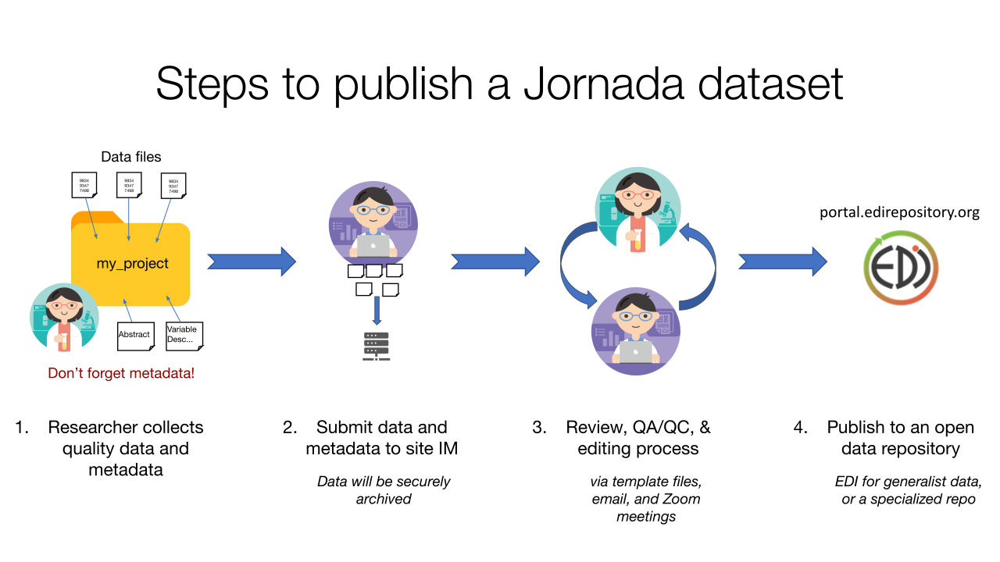
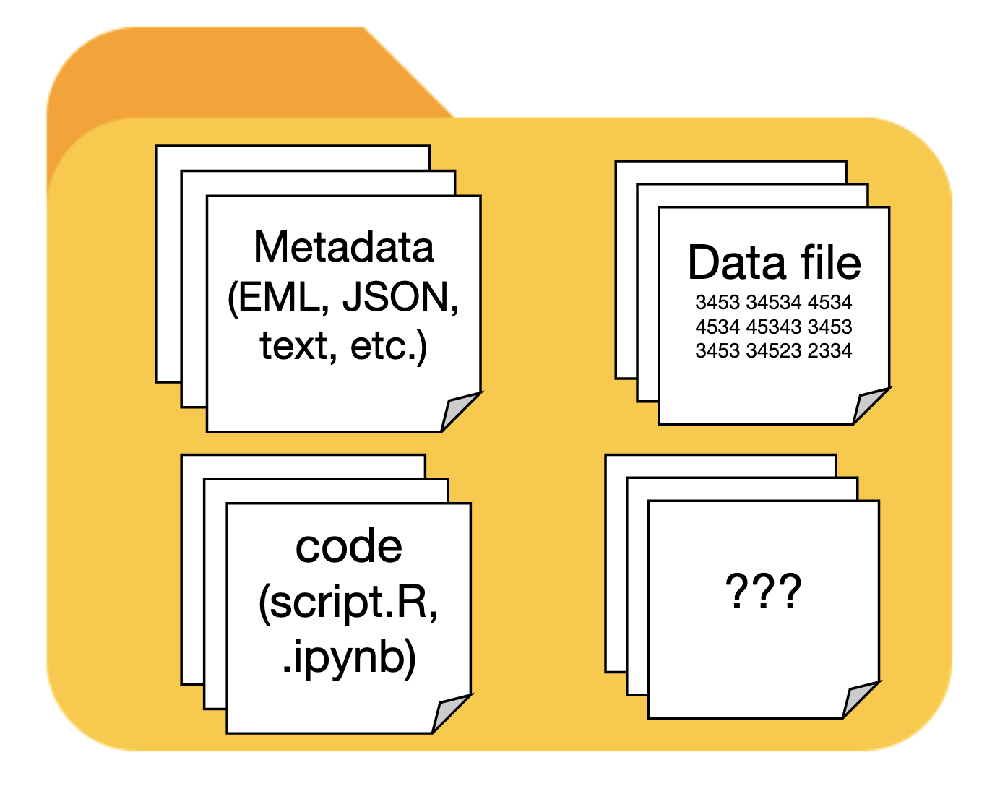

## Overview

Once your data are assembled, cleaned, and analyzed, you should strongly consider publishing them for future use and posterity. There are many reasons to do so; publishing data is required by the LTER Network[^1], and strongly encouraged or required by most funding sources[^2] and journals[^3]. On top of this, published datasets often become well-used, highly-cited research products in their own rite, and thus add a "feather in the cap" to your academic record.

There are some standards to aspire to when publishing a dataset, the most prominent being to make the data **findable**, **accessible**, **interoperable**, and **reusable**, or FAIR [@wilkinson_fair_2016]. You've already learned the basics of making data FAIR. In the [Collecting data](collecting-data.qmd) chapter we covered how to collect, clean, and store quality data, including recommendations on how to structure and format the data themselves. The [Metadata](metadata.qmd) chapter discusses the value of descriptive metadata, and gives recommendations on the content and management of metadata you collect during research. You may want to refer back to these chapters as you are preparing a dataset for publication.

To prepare a dataset for publication, you'll need to make a few decisions first.

  1. What data and metadata files will your dataset contain?
  2. Where will you publish the dataset?
  3. How will you assemble the dataset and publish it?

We explore the answers to these questions below, but an overview of the process is shown in @fig-jornadapublish. You, the researcher, are responsible for collecting quality data **and metadata**, and notifying the Jornada IM team when you are ready to publish (though often we'll ask you...). Once you provide the data and metadata files to an IM, an iterative curation process begins, with the aim of creating a publishable dataset that meets the standards of the research community (the Jornada and the LTER Network, in this case). After a round or two of review and editing, you or IM team will publish the completed dataset to the chosen data repository.

{width=100% #fig-jornadapublish}

[^1]: See the [LTER Network Data Access Policy](https://lternet.edu/data-access-policy/).
[^2]: NSF requires sharing of data from funded projects [as a general rule](https://www.nsf.gov/funding/data-management-plan#nsfs-data-sharing-policy-1c8), and outlines specific requirements [in the PAPPG](https://www.nsf.gov/policies/pappg/24-1/ch-11-other-post-award-requirements#ch11D4).
[^3]: For example, both [AGU](https://www.agu.org/publications/authors/journals/data-software-for-authors) and [ESA](https://esa.org/publications/data-policy/) now have strict open data policies for their society journals.

## What's in your dataset?

It can be difficult to visualize what a published dataset should contain. At a minimum, there will be one or more data files, and a collection of metadata that thoroughly describes the data (ideally in human- and machine-readable form).However, there are many other things a published dataset can contain:

* The **code** you used to analyze the data
* **Maps** of the study plots or sampling locations
* **Documentation files**, such as field or lab protocols, in PDF or Microsoft Word format.
* Any **images** that are used as data or provide context for the data (aerial photos, camera trap images, etc.)

{width=40% #fig-datasetcontent}

## Choosing a repository to publish in

There are many data repositories available to researchers now [^4], and choosing one is not necessarily easy. Make sure the repository you choose meets these essential criteria. 

1.  The repository should issue persistent, internet-resolvable, unique identifiers for every dataset published. Generally this will be a Digital Object Identifier, or DOI, that can be easily cited any time the published dataset is used.
2. The repository should require and publish adequate metadata describing each dataset. Without requiring at least minimal metadata, no repository can ensure that published data are FAIR.
3. The repository should be trusted and accepted by your research community. This helps ensure your data will be found by researchers who value and will use them, including your collaborators. Community buy-in can also signal that the repository has stable support and data will be available in perpetuity (though there are no guarantees here). 

 We recommend using the [Environmental Data Initiative]() as the destination repository for most research data collected at the Jornada. For some data types, and non-data research products, we recommended other repositories that are specialized for a particular research domains, or have especially useful features. Publishing in non-EDI repositories can have advantages if they provide features for your particular type of data, or are your research community's accepted data source. Recommended repositories for a range of Jornada data and use cases are described below.

[^4]: The Registry of Research Data Repositories ([re3data.org](https://re3data.org)) project is a comprehensive tracker of information about research data repositories.

::: {.panel-tabset}

## Most Jornada data

::: {style="float: right; margin: 5px;"}
{width=150}
:::

The recommended repository for most tabular ecological or environmental data produced by the Jornada Basin LTER program is [Environmental Data Initiative]() (EDI). The EDI repository supports rigorous metadata standards and facilitates the re-use of environmental data. The repository originated in the LTER Network, so EDI is accepted and trusted by the ecological research community. It is also well-integrated into the Jornada's information management systems.

**Resources:**

* EDI provides extensive [resources for data authors](https://edirepository.org/resources/resources-for-data-authors).
* The [EDI data portal]() is the main web interface for searching and accessing data published in the repository.
* The [ezEML application]() is EDI's metadata editor for producing detailed, consistent EML metadata files for your dataset.

## EC Fluxes

::: {style="float: right; margin: 5px;"}
{width=120}
:::

Ecosystem-scale mass and energy fluxes measured using the eddy covariance method (i.e. flux towers) are common at established, long-term research sites like the Jornada. They help ecosystem scientists understand carbon, water, and energy balance of ecosystems, and the cycling of important greenhouse gases, across the globe. The [FluxNet](https://fluxnet.org) network unites and organizes the worldwide flux community, and the member [AmeriFlux](https://ameriflux.lbl.gov/) network is the sub-network for the Americas. Together, FluxNet and AmeriFlux and publish data from hundreds of flux tower sites. Since flux data can be relatively easily standardized (according to [Ameriflux guidance](https://ameriflux.lbl.gov/data/aboutdata/)) and are commonly used in cross-site studies, it makes sense to publish data from flux towers together in one repository. We recommend that Jornada flux data are published at AmeriFlux whenever possible.

**Resources:**

## Molecular/microbiome

::: {style="float: right; margin: 5px;"}
{width=120}
:::

Molecular and microbiome data, including data from amplicons, genomes, metagenomes, transcriptomes, and other "omes" are generally most useful in databases designed for those data. Many of these databases, including [National Center for Bioinformatics Information (NCBI) GenBank](), [EMBL-EBI repositories](https://www.ebi.ac.uk/submission/), and Japan's [DDBJ](https://www.ddbj.nig.ac.jp) share data via the [International Nucleotide Sequence Database Collaboration](https://www.insdc.org/). Some major molecular sequencing facilities ([Joint Genome Institute (JGI)](https://jgi.doe.gov/work-with-us/offerings-capabilities), [EMBL facilities](https://www.embl.org/services-facilities/)) automatically contribute sequences to this collection of databases. If your samples are sequenced independently of these major facilities, we strongly recommend submitting sequence data to [NNCBI GenBank](https://submit.ncbi.nlm.nih.gov/). If you submit externally-sequenced data to JGI analytical platforms (without sequencing there), you will need to deposit the data in NCBI GenBank on your own.

**Resources:**

## Code & documents

::: {style="float: right; margin: 5px;"}
{width=150}
:::

Publishing the code used to prepare and analyze data, and generate statistics or figures, is an important aspect of reproducible science, and is usually requested or required when publishing research results. There are also many research products that are not peer-reviewed journal articles or datasets, but that still need to be published with a DOI(whitepapers, presentations, posters). We recommend publishing both of these in the [Zenodo](https://zenodo.org/) repository. Zenodo is a large, generalist repository created and supported by the [European Laboratory for Particle Physics (CERN)](https://home.cern/).

**Resources:**

* If you are managing your code in [GitHub](https://github.com), there is an easy-to-use [GitHub to Zenodo publishing integration](https://docs.github.com/en/repositories/archiving-a-github-repository/referencing-and-citing-content) that you can use to publish your repository and issue a Zenodo DOI for it (also see the [Zenodo docs](https://help.zenodo.org/docs/github/)).

:::

::: {.callout-warning}
## A note on repository choice

The IM team recommends EDI for most Jornada data, but if you opt to publish in a different repository, keep in mind that:

* Jornada data managers can provide some guidance, but more of the responsibility for metadata preparation and publishing will fall to you.
* The IM team still needs to know about Jornada datasets published outside EDI, so please notify us!

*Despite these caveats, it is best to choose a repository where you and your collaborators know the data will be discovered and used.*

:::

## Assembling the metadata

To ensure successful interpretation and re-use of the data after they are published, they must be accompanied by metadata that thoroughly describe them. For more guidance on the importance of high-quality data and metadata and how to collect them, review the [Collecting data](collecting-data.qmd) and [Metadata](metadata.qmd) chapters, or review resources at the [EDI repository](/resources/creating-metadata-for-publication). Ideally, metadata should be in a format that provides rich detail and is both human- and machine-readable, and we recommend using EML for most Jornada datasets. Two methods to produce valid EML metadata are described below, but if you are sure you won't be publishing in EDI or using EML, start with the templates and contact a Jornada data manager for further help. 

### ezEML

The EDI repository has created a web app called [ezEML]() for describing research datasets and creating a standardized metadata documents for publication. The ezEML app creates metadata documents in the Ecological Metadata Language, or EML, which is a dialect of XML. The tool simplifies most of the complexity of EML and XML, and is an easy method to author well-documented datasets. There is a **Jornada EML template** available on the site, so the recommended process for Jornada researchers is:

  1. Log in to [ezEML]() using your Google, GitHub, or ORCID account (whichever is easiest).
  2. Start a new EML dataset using the **EML Documents > New from Template** menu item.
  3. Navigate to and select the **LTER/JRN/JRN_template_general** template to open an EML template pre-populated with Jornada metadata.
  4. Give the dataset a unique name. You can save your metadata and then return to this document anytime.
  5. Follow the sequence of forms on the left, and ezEML's prompts, to upload data files and enter metadata for your dataset. Each section of your metadata will have help available ("?" icons) and several fields will already be filled if you are using the JRN template.
  6. Use the **Check metadata** and **Check data tables** tools at the bottom left to check the completeness and validity of your dataset. Green badges next to metadata mean your dataset is well described and ready to share (and yellow or red can indicate missing values or errors).
  7. When ready, click **Submit/Share Package** and then **Collaborate with Colleagues**. *DO NOT USE **Submit Package to EDI** or we may miss your dataset*.
  8. On the **Invite a Collaborator** screen, share the dataset with a Jornada data manager by entering the () email.

  At this point, the Jornada IM Team will receive a notification and can access your dataset in ezEML to review, edit, and publish to EDI. It never hurts to send a reminder in case the data managers miss this EDI notification. Keep in mind that you can start an EML document in ezEML, then save it and continue later. Just be sure to use the same login as before.

### Metadata templates

A metadata template is a document with a structure and cues that help you collect the essential metadata needed to describe a published dataset. We have created Jornada metadata templates in Microsoft Word (.docx) and Excel (.xlsx) formats that are available on the [downloads page](../../downloads/index.qmd). These templates contain sections for all critical pieces of metadata, along with instructions on what to include and how to structure the information. The Excel version is slightly more detailed and may be useful for complex datasets. Completed templates and accompanying data files should be sent to the Jornada IM team ().

## The review process

Once you have submitted the dataset to the Jornada IM team, the data and metadata are securely archived and a round of review and editing begins (see @fig-jornadapublish). A data manager will review the metadata for completeness, compliance with Jornada standards, and mismatches between metadata and data. If revisions are needed or errors are found you will receive an email requesting the changes. Changes can be submitted in ezEML, or with an updated metadata template, as appropriate.

## Publishing the dataset

Once revisions are complete and the dataset authors agree to publish the dataset, the IM creates a final EML file, and then sends it, with the data, to the Environmental Data Initiative repository (EDI) to publish the dataset. A dataset citation, with a DOI, will be emailed to the dataset authors for distribution. **If you are NOT publishing at EDI the publishing process will be different, and you may be expected to handle more of it yourself**.

