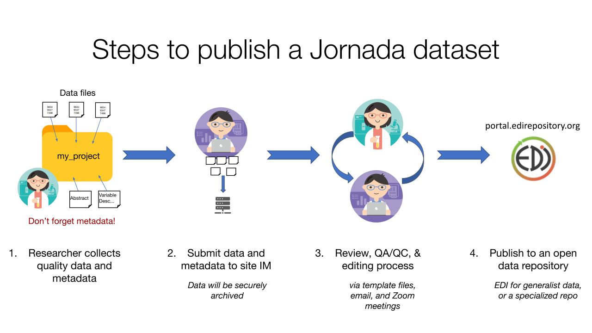

# For Researchers 

Jornada PIs, postdocs, students, staff scientists and others who contribite to research at the Jornada should be aware of the standards and requirements for collecting and documenting their research data. 

Data and metadata submission requirements for Jornada researchers are [outlined on the JRN LTER  website](https://lter.jornada.nmsu.edu/for-researchers) or the [JER website](https://jornada.nmsu.edu/ltar/data/documentation) (the requirements are similar).

<figure>
  
  <figcaption><em>Figure 1: A simplified schematic of how to publish a Jornada dataset.</em></figcaption>
</figure>  

## Metadata templates

When starting a new data collection effort or getting ready to publish an existing one, it helps to have a metadata template. The documents below will help you fill in all necessary and relevant metadata to accompany your data for publication. Completed templates and data files should be sent to the Jornada IM team.

* Get the [Jornada metadata template](https://github.com/jornada-im/documentation/raw/main/templates/Jornada_metadata_template.docx) (.docx).
* While writing metadata, the [Jornada metadata standards](https://github.com/jornada-im/documentation/raw/main/standards/JRN_metadata_standards.docx) (.docx) and [keyword thesauri](https://github.com/jornada-im/documentation/raw/main/standards/keyword_thesauri.xlsx) (.xlsx) documents are helpful, but not required.

## Other resources

### Jornada Presentations

* [Navigating the Jornada Data Ecosystem](https://lter.jornada.nmsu.edu/navigating-the-jornada-data-ecosystem/) (Jornada Symposium 2020)
* [Researcher orientation to IM at Jornada LTER](https://docs.google.com/presentation/d/1oXbBcmw_3i_wmbvaa6x4CNMKhYPW1mNp/edit?usp=sharing) (JRN Ecology Short Course, July 2021)

### LTER/EDI resources

Jornada Basin LTER data packages are generally submitted to the EDI (Environmental Data Initiative) repository. They have resources about data collection, curation, and publishing.

* EDI's [5 phases of data publishing](https://environmentaldatainitiative.org/resources/five-phases-of-data-publishing/)
